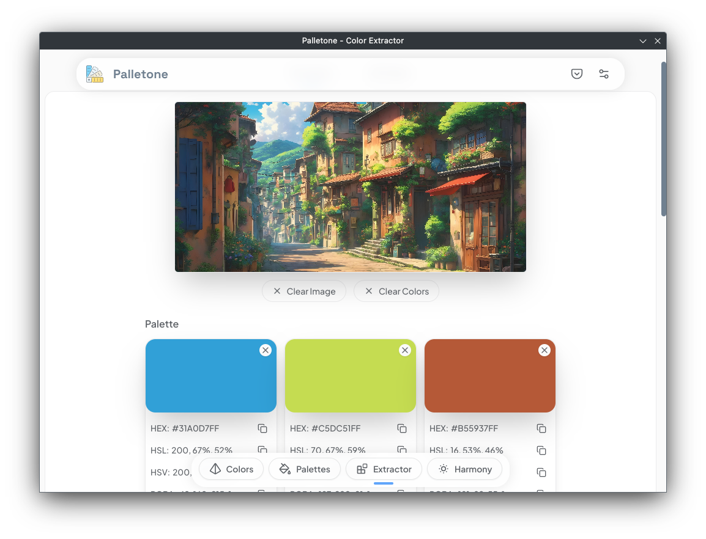

# Palletone (React.JS + Electron.JS + Typescript)

> **Access this app live at: [https://palletone-demo.vercel.app](https://palletone-demo.vercel.app)**

<div align="center">

[](https://github.com/KainNhantumbo/palletone-app/actions/workflows/build.yml)
[](https://github.com/KainNhantumbo/palletone-app/actions/workflows/release.yml)

</div>

🎉 Welcome to **Palletone** app repository, a multi-platform application built with Electron.JS, React and Typescript, and of course, with a flavour of other awesome community open source packages.

This app aims to bring a new experience of collecting, managing and building color palettes for designers and web developers.

The main goal is to simplify the process providing the right tools for choosing the preferred color for their project.

Feel free to try it on any device of yours and bake your own color flavor for your next project! 🥳

> - ✨ **Supported modes:** Solid colors, gradients, auto palette generator and color extrator (extracts color form images), analogous palette, triadic palette, complement and split complement palettes, tetradic palette and monochromatic palette.
> - ✨ **Supported color channels:** HSVA, HSLA, RGBA and HEX.
> - ✨ **Platforms:** PWA, Web and desktop (Linux and Windows).
> - ✨ **App Themes:** Light and dark.

## **Here are some screenshots:**

|  |  |
| ------------------------ | ------------------------ |
|  |  |
| ------------------------ | ------------------------ |
|  |  |

## 🌠 Project status

Note: This project is concluded, but I am maintaining it. You can expect to see more features being added in the future. Enjoy!!

## 🌳 Project structure

```bash
$ROOT
├── electron
├── public
└── src
    ├── assets
    ├── components
    │   └── ui
    ├── hooks
    ├── lib
    ├── routes
    ├── shared
    ├── styles
    └── types
```

## 🐾 Project Stack (and main packages)

- **React.JS** - library used to build big, fast Web apps with JavaScript.
- **Typescript** - a superset language of Javascript that provides typechecking.
- **Electron.JS** - a framework for building desktop applications using javascript, html and css.
- **Tailwind CSS** - for component styling.
- **Vite** - a next generation frontend tooling.
- **tinycolor2** - library to color management and transformation.
- **Shadcn Components** - brings styled radix-ui components with tailwind css.

## 🎊 Features Log

See all important logs that are documented here, on this [changelog file](CHANGELOG.md).

## 🏗️ Local Setup

Make sure you have installed **Node.js (v18.17.0 or later recommended) which also comes with npm v9.6.7**.\
In the project directory, you can run in terminal:

- Runs the app in the development mode and the server will reload when you make changes to the source code for the render and electron scripts:

```bash
npm ci && npm run dev
```

- Builds the web version of the app for production to the **dist folder**:

```bash
npm run build
```

- Builds the electron app for locally production. **Note that only** windows and linux application packages a pre-configured to be built. Please refer to other scripts in the [package.json](package.json):

```bash
npm run electron:build
```

## ☘️ Find me!

E-mail: [nhantumbok@gmail.com](nhantumbok@gmail.com 'Send an e-mail')\
Github: [https://github.com/KainNhantumbo](https://github.com/KainNhantumbo 'See my github profile')\
Portfolio: [https://codenut-dev.vercel.app](https://codenut-dev.vercel.app 'See my portfolio website')\
My Blog: [https://codenut-dev.vercel.app/en/blog](https://codenut-dev.vercel.app/en/blog 'Visit my blog site')

#### If you like this project, let me know by leaving a star on this repository so I can keep improving this app or [send support](https://www.buymeacoffee.com/nhantumbokU/)!\*\* .😊😘

Best regards, Kain Nhantumbo.\
✌️🇲🇿 **Made with ❤ Electron.JS + React + Vite and Typescript**

## Contributing

See this [Contributing Guide](CONTRIBUTING.md).

## 📜 License

Licensed under Apache License Version 2.0. All rights reserved.\
Copyright &copy; 2024 Kain Nhantumbo.

Licensed under the Apache License, Version 2.0 (the "License"); you may not use this file except in compliance with the License. You may obtain a copy of the License at http://www.apache.org/licenses/LICENSE-2.0

Unless required by applicable law or agreed to in writing, software distributed under the License is distributed on an "AS IS" BASIS, WITHOUT WARRANTIES OR CONDITIONS OF ANY KIND, either express or implied. See the License for the specific language governing permissions and limitations under the License.
